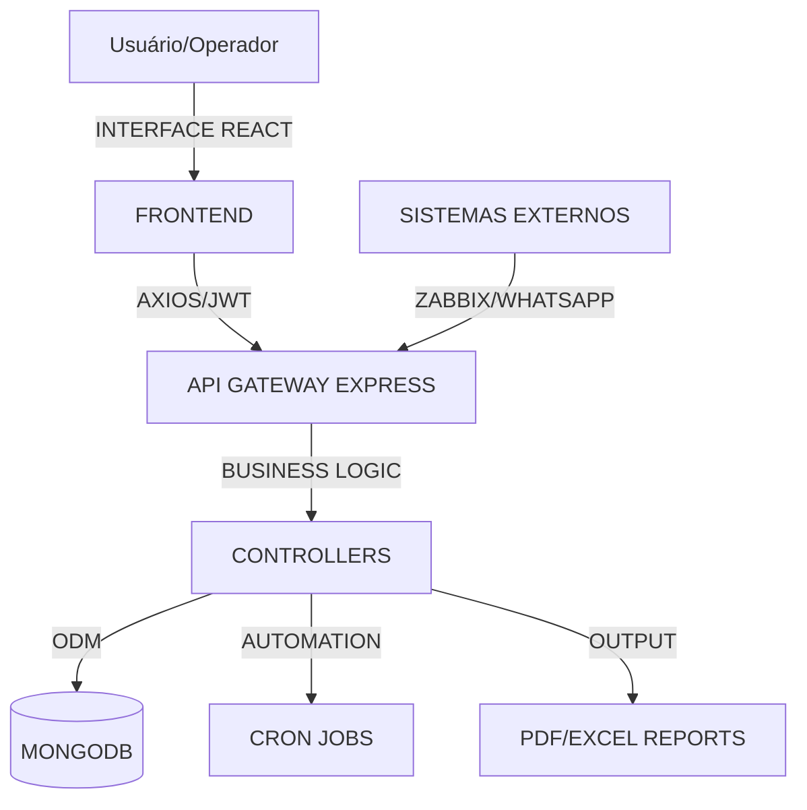

# 🌐 Sistema Integrado de Gestão - Documentação Técnica e Operacional

**Versão:** 4.0.0  
**Data:** 13/02/2026  
**Ambiente:** http://10.1.1.120

---

## 📋 Sumário Executivo

Este documento detalha o ecossistema de software desenvolvido para centralizar a gestão de TI, operações industriais (frigorífico), controle de portaria e gestão de pessoas. O sistema utiliza uma arquitetura moderna de microsserviços monolíticos (Single API) com um frontend unificado, permitindo modularidade e escalabilidade.

---

## 🛠️ 1. Arquitetura Técnica (Tech Stack)

### Backend (Node.js/Express)
- **Runtime:** Node.js 18+
- **API:** RESTful com Express.js.
- **Banco de Dados:** MongoDB (NoSQL) via Mongoose.
- **Segurança:** 
  - Autenticação via **JWT** (JSON Web Tokens).
  - Criptografia de senhas com **bcryptjs**.
  - Proteção de cabeçalhos com **Helmet**.
  - Limitação de taxa (**Rate Limiting**) para prevenção de ataques DoS.
- **Automações:** **node-cron** para tarefas agendadas (verificação de certificados, limpeza de logs).
- **Relatórios:** **PDFKit** para geração de PDFs e **XLSX** para planilhas Excel.

### Frontend (React/TypeScript)
- **Ferramenta de Build:** Vite (Alta performance).
- **Linguagem:** TypeScript (Tipagem estática para robustez).
- **Estado Global:** Context API (AuthContext, ModuleContext).
- **UI/UX:**
  - **Lucide React** para iconografia.
  - **Recharts** para dashboards dinâmicos.
  - **Dnd-kit** para funcionalidades de arrastar e soltar (reordenamento de lotes).
  - **Vanilla CSS** com variáveis globais para temas.

---

## 🧩 2. Módulos do Sistema

### 🎫 2.1. ITSM (Help Desk / Tickets)
**Objetivo:** Gestão completa do ciclo de vida de chamados técnicos.
- **Fluxo Operacional:** 
  - Abertura (Interna ou Portal Público) → Triagem → Atribuição → Atendimento → Resolução → Encerramento.
- **Diferenciais Técnicos:**
  - **Níveis de Suporte:** N1, N2 e N3.
  - **SLA:** Monitoramento de prazos por prioridade.
  - **Timeline:** Histórico imutável de eventos por ticket.
  - **Portal Público:** Permite que usuários externos abram tickets sem login.

### 💻 2.2. CMDB (Gestão de Ativos - Ativos TI)
**Objetivo:** Inventário e controle patrimonial de hardware e software.
- **Operacional:** Cadastro, movimentação entre setores, controle de garantia e manutenções.
- **Técnico:** Integração com o módulo de Tickets para vincular falhas a ativos específicos. Relatórios analíticos de valor depreciado e distribuição por setor.

### 🥩 2.3. Industrial (Escala de Abate & Desossa)
**Objetivo:** Planejamento e controle da produção frigorífica.
- **Escala de Abate:**
  - Gerenciamento de lotes por pecuarista.
  - Cálculo automático de horários baseado na taxa de abate/hora.
  - Geração de romaneios e mapas de abate em PDF.
- **Programação de Desossa:**
  - Importação automática de dados do abate.
  - Registro de produção por corte (Traseiro, Dianteiro, etc.).
  - Controle de rendimento e balanço de massa.

### 🚗 2.4. Portaria (Gatehouse)
**Objetivo:** Controle de acesso de veículos e pessoas.
- **Operacional:** Registro de placa, motorista, empresa, hora de entrada e saída. Controle de status (No Pátio, Carregando, Concluído).
- **Técnico:** Dashboard em tempo real com ocupação do pátio e tempos de permanência.

### 👥 2.5. GEP (Gestão de Pessoas / HR)
**Objetivo:** Recrutamento e Seleção.
- **Operacional:** Cadastro de cargos (Job Positions) e gestão de candidatos. Fluxo de contratação e histórico de entrevistas.
- **Público:** Formulário externo para candidatos enviarem currículos.

### 📊 2.6. NOC & Infraestrutura (Network Monitoring)
**Objetivo:** Monitoramento de saúde da rede.
- **Operacional:** Visualização de dispositivos ativos, alertas de queda.
- **Técnico:** Integração visual/links com **Zabbix** e monitoramento de certificados SSL/e-CNPJ com alertas automáticos via e-mail/notificação.

### 💰 2.7. Financeiro (Boletos & Compras)
**Objetivo:** Controle de despesas e aquisições.
- **Boletos:** Monitoramento de vencimentos de licenças e serviços.
- **Compras:** Fluxo de Solicitação → Cotação → Ordem de Compra.

---

## 🔒 3. Segurança e Controle de Acesso (RBAC)

O sistema utiliza quatro níveis de permissão:
1. **Master User:** Acesso a métricas gerenciais, BI e auditoria completa.
2. **Admin:** Gestão de usuários, configurações globais e todos os módulos.
3. **Técnico:** Operação completa de módulos produtivos e suporte.
4. **Cliente/Usuário:** Acesso limitado a visualização e abertura de solicitações próprias.

---

## 🚀 4. Operação e Manutenção

### Scripts Principais (Raiz do Projeto)
- `start.ps1`: Inicia backend e frontend simultaneamente.
- `stop.ps1`: Encerra processos e libera portas (3000, 80).
- `backup.ps1`: Gera dump automático do MongoDB.
- `verificar-banco.ps1`: Diagnóstico de integridade dos dados.

### Variáveis de Ambiente (.env)
- `MONGODB_URI`: String de conexão com o banco.
- `JWT_SECRET`: Chave de assinatura para tokens de segurança.
- `VITE_API_URL`: Endpoint da API para o frontend.

---

## 📈 5. Fluxo de Dados (Mermaid)

---

> **Nota de Implantação:** Todo o sistema foi desenhado para rodar em servidor local (`10.1.1.120`) mas é compatível com deploy em nuvem (AWS/Azure) através de containerização Docker (preparada no backend).
